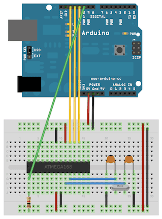
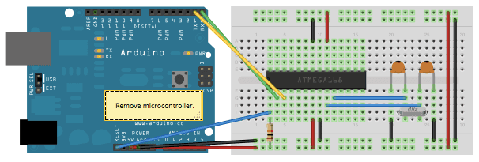

# Arduino to Breadboard

This tutorial explains how to program an ATmega328P on a breadboard using an Arduino board as an ISP programmer.

---

## Overview

Sometimes you may want to shrink your Arduino project down to just the microcontroller (ATmega328P), without the full Arduino board.  
This guide shows you how to program an ATmega328P on a breadboard by using an Arduino as an In-System Programmer (ISP).

---

## Hardware Required

- Arduino board (Uno, Nano, etc.)
- ATmega328P microcontroller
- 16 MHz crystal
- 2 x 22 pF capacitors
- 10k ohm resistor
- Breadboard
- Jumper wires

---

## Circuit

You need to wire up the ATmega328P microcontroller on a breadboard.

**Basic wiring:**
- Pin 7 (VCC) → +5V
- Pin 8 (GND) → GND
- Pin 22 (GND) → GND
- Pin 21 (AREF) → +5V (optional)
- Pin 20 (AVCC) → +5V
- 16 MHz crystal between pins 9 and 10, with 22 pF capacitors from each pin to ground.
- 10k ohm pull-up resistor between pin 1 (RESET) and +5V.

**Programming Connections (from Arduino to Breadboard ATmega328P):**
- Arduino pin 10 → RESET
- Arduino pin 11 → MOSI (pin 17 on ATmega)
- Arduino pin 12 → MISO (pin 18 on ATmega)
- Arduino pin 13 → SCK (pin 19 on ATmega)
- Common Ground between Arduino and breadboard.

---

## Bootloading the ATmega328P

If your ATmega328P is blank (without a bootloader), you'll first need to burn the bootloader.

**Steps:**

1. **Upload ArduinoISP sketch to your Arduino.**
   - Open `File > Examples > 11.ArduinoISP > ArduinoISP`
   - Select your Arduino board and COM port.
   - Upload.

2. **Select the correct board settings.**
   - Tools > Board: Arduino Uno
   - Tools > Programmer: Arduino as ISP
   - Tools > Burn Bootloader

Once done, the ATmega328P will have the Arduino bootloader installed.

---

## Uploading Sketches

You can now upload sketches directly using the Arduino as ISP.

**Steps:**

1. **Select Sketch:**
   - Open any Arduino sketch you want to upload.

2. **Upload Using Programmer:**
   - Tools > Programmer: Arduino as ISP
   - Sketch > Upload Using Programmer (or press `Shift + Upload`)

This will bypass the bootloader and directly flash your program onto the ATmega328P.

---

## Notes

- If you don't want to use an external 16 MHz crystal, you can use the internal 8 MHz oscillator by selecting "ATmega328 on a breadboard (8 MHz internal clock)" from the Tools > Board menu. (But you must burn a new bootloader for 8 MHz!)
- Always ensure the connections are secure.
- Some ATmega328P chips come preloaded with the bootloader. In that case, you can skip burning the bootloader.

---

## References

- [Arduino as ISP](https://docs.arduino.cc/built-in-examples/arduino-isp/ArduinoISP/)
- [Minimal Circuit for ATmega328P](https://www.arduino.cc/en/Main/Standalone)

---

# 📸 Images

You should download these important images from the original blog and place them in your GitHub `/assets/` folder:

- Breadboard wiring diagram
- Programming connection diagram
- Arduino as ISP diagram

**In Markdown:**

```markdown


```

(You will need to save the images manually.)

---

# 📂 How to organize it in GitHub

```
/your-repo
  /docs
    ArduinoToBreadboard.md
    ArduinoToBreadboard.pdf (optional)
  /assets
    breadboard-wiring.png
    arduino-isp.png
  README.md
```

